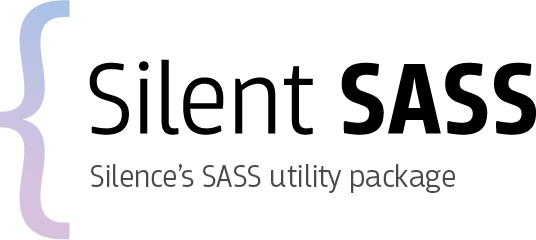

<br>

<p align="center">

</p>

<br>
<p align="center">
Is package containing helpful set of mixins and sass utilities to start
devloping responsive sites.
</p>

<br>
<br>

## Installation

```shell
npm install silent-sass
```

It is also recommended to install [laravel-mix](https://github.com/JeffreyWay/laravel-mix) or [webpack](https://github.com/webpack) and [sass-loader](https://github.com/webpack-contrib/sass-loader).
If you have installed __laravel-mix__ and __sass-loader__ webpack config file
should be modified to work with sass-loader:

```js
// your's webpack.mix.js file
mix.webpackConfig({
    module: {
        loaders: [{
            test: /\.scss$/,
            loader: 'style!css!sass'
        }]
    }
})
```

## Config variables

It is recommended to set some default variables eg.

```scss
$base-font-size: 16px !default;    // Absolute height of body text, in pixels
$base-line-height: 24px !default;  // Absolute height of one line of type, in pixels
$rhythm-font-unit: px !default;    // The font unit to use when returning values in rhythm functions
$min-line-padding: 2px !default;   // Ensure there is at least this many pixels of vertical padding above and below the text.

// Allows to round the line height to the nearest half line height instead of the nearest integral line.
$round-to-nearest-half-line: false !default;
```

## License
This package is licensed under the [MIT](license.md) license.